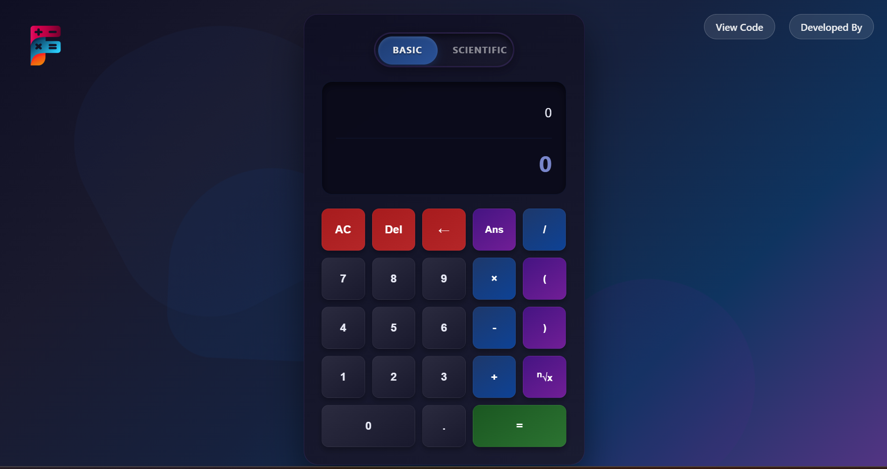
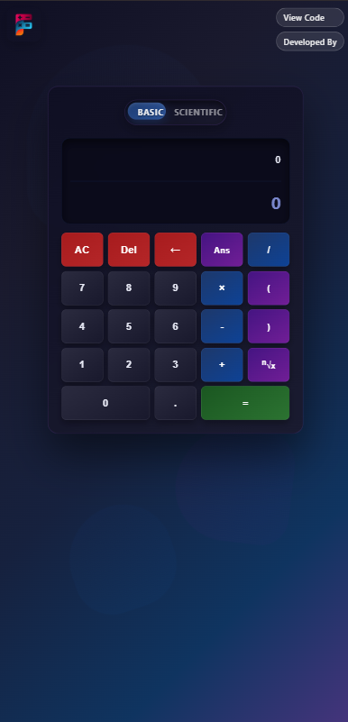

# 🔢 Dynamic Two-Mode Scientific Calculator

A sleek and modern **Scientific Calculator** supporting both **Basic** and **Scientific** modes. Designed with a dark UI theme and responsive layout for desktop and mobile. Built using **HTML**, **CSS**, and **Vanilla JavaScript**.

---

## 🔍 Preview

| 💻 Desktop View | 📱 Mobile View |
|----------------|----------------|
|  |  |

---

## ✨ Features

- 🔄 Switch between **Basic** and **Scientific** calculator modes
- 🧮 Real-time result display
- 🧠 `Ans`, `AC`, `Del`, and full math operations
- 🎯 Clean and intuitive interface
- 📱 Fully **responsive** for all screen sizes

---

## 🚀 Technologies Used

- HTML5
- CSS3
- JavaScript (Vanilla)

---

## 📁 Project Structure

```text
├── index.html
├── style.css
├── script.js
├── screenshots/
│   ├── desktop.png
│   └── mobile.png
└── README.md
```

---

## 🌐 Live Portfolio

Want to see more of my work?

👉 [Visit My Portfolio](https://fahad-ali-github.github.io/FAHAD-ALI-Portfolio/)

---

## 🧑‍💻 Developer

**Fahad Ali**  
🔗 [GitHub Profile](https://github.com/FAHAD-ALI-github)

---

## 🛠️ How to Run

1. Clone this repo:
   ```bash
   git clone https://github.com/FAHAD-ALI-github/scientific-calculator.git
   ```

2. Open `index.html` in your browser.

---

## 🌟 Show Your Support

If you like this project:

- ⭐ Star the repo
- 🍴 Fork it
- 🐛 Report bugs or suggest features

---
